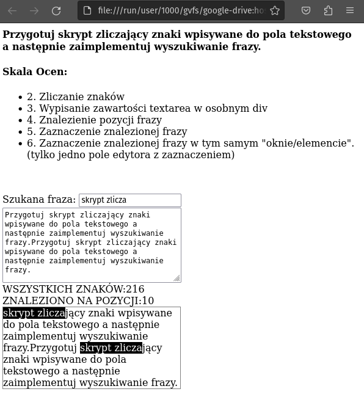

https://www.youtube.com/shorts/aXcuz6fn8_w

# 320-Sprawdzian_PAI

Przygotuj skrypt zliczający znaki wpisywane do pola tekstowego a następnie zaimplementuj wyszukiwanie frazy.

Skala Ocen:

2 - Zliczanie znaków

3 - Wypisanie zawartości textarea w osobnym div

4 - Znalezienie pozycji frazy

5 - Zaznaczenie znalezionej frazy

6 - Zaznaczenie znalezionej frazy w tym samym "oknie/elemencie". (tylko jeden element edytora z wpisywaniem i zaznaczeniem)

DODATKOWO:

- zliczanie słów
  
- ustaw limit słów po przekroxczeniu którego obramowanie pola tekstwego zmieni się na czerwone
